# AIDeepIn Web

## 介绍

本仓库是langchain4j-aideepin的前端项目

**LangChain4j-AIDeepin（得应） 是基于AI的工作效率提升工具。**

 *可用于辅助企业/团队进行技术研发、产品设计、规章制度咨询、系统或商品咨询、客服话术支撑等工作*

> **🌟该项目如对您有帮助，欢迎点赞🌟**

## 系统组成及文档

AIDEEPIN

&nbsp;&nbsp;&nbsp;&nbsp;&nbsp;&nbsp;|__ 服务端(langchain4j-aideepin)

&nbsp;&nbsp;&nbsp;&nbsp;&nbsp;&nbsp;|__ 用户端WEB(langchain4j-aideepin-web)

&nbsp;&nbsp;&nbsp;&nbsp;&nbsp;&nbsp;|__ 管理端WEB(langchain4j-aideepin-admin)

👉[详细文档](https://github.com/moyangzhan/langchain4j-aideepin/wiki)

代码仓库地址： [github](https://github.com/moyangzhan/langchain4j-aideepin-web)   [gitee](https://gitee.com/moyangzhan/langchain4j-aideepin-web)

关联项目

* 后端服务 langchain4j-aideepin:
  * [github](https://github.com/moyangzhan/langchain4j-aideepin)
  * [gitee](https://gitee.com/moyangzhan/langchain4j-aideepin)
* 管理端WEB langchain4j-aideepin-admin:
  * [github](https://github.com/moyangzhan/langchain4j-aideepin-admin)
  * [gitee](https://gitee.com/moyangzhan/langchain4j-aideepin-admin)

## 功能点

* 多会话（多角色）
* 图片生成（文生图、修图、图生图）
* 基于大模型的知识库（RAG）
  * 向量搜索
  * 图搜索
* AI工作流
* MCP服务市场
* ASR & TTS
  * 提问及回复的格式可选
    * 文字提问-文字回复
    * 文字提问-语音回复
    * 语音提问-文字回复
    * 语音提问-语音回复
  * AI的音色可选
* 长期记忆

## 接入的平台/模型：

* DeepSeek
* OpenAI
  * gpt-5-mini
  * gpt-image-2
* 灵积
  * 通义千问
  * 通义万相
* 硅基流动
* 文心一言
* ollama

## 前置要求

### Node

`node` v20+

推荐使用使用 [nvm](https://github.com/nvm-sh/nvm) 管理本地多个 `node` 版本

### PNPM

pnpm v9+

如果你没有安装过 `pnpm`

```shell
npm install pnpm -g
```

## 安装依赖

根目录下运行以下命令

```shell
pnpm bootstrap
```

## 本地环境开发

1、修改根目录下 `.env` 文件中的 `VITE_GLOB_API_URL` 为你的实际后端口地址

2、根目录下运行以下命令

```shell
pnpm dev
```

3、如后端服务为远程地址，使用nginx解决跨域问题

nginx配置参考 [./docker-compose/nginx/nginx.conf](docker-compose/nginx/nginx.conf)

## 正式环境

### 发布方式1 - 使用 Docker

#### Docker build & Run

```bash
docker build -t aideepin-web .

# 前台运行
docker run --name aideepin-web --rm -it -p 127.0.0.1:1002:1002 aideepin-web

# 后台运行
docker run --name aideepin-web -d -p 127.0.0.1:1002:1002 aideepin-web

# 运行地址
http://localhost:1002/
```

### 发布方式2 - 手动打包

1、 nginx配置

服务器上nginx的配置可以参考 `./docker-compose/nginx/nginx.conf`，将 `proxy_pass http://localhost:9999/;` 中的 `localhost:9999`改成后端服务对应的ip及端口

**如果管理端WEB跟用户端WEB使用同一个nginx**，可参考以下配置：

```shell
# adi-web存放的是用户端构建后的代码
# adi-admin-web存放的是管理端构建后的代码

# 用户端WEB页面配置
# 访问地址：http://你的ip:port/
location / {
  root /usr/share/nginx/adi-web;
  try_files $uri /index.html;
}

# 管理端WEB页面配置
# 访问地址：http://你的ip:port/admin
  location /admin/ {
    alias /usr/share/nginx/adi-admin-web/;
   	index /index.html;
  }

# 后端服务
location /api/ {
  proxy_set_header X-Real-IP $remote_addr; #转发用户IP
  proxy_pass http://localhost:9999/;
}
```

2、根目录下运行以下命令，[参考信息](https://cn.vitejs.dev/guide/static-deploy.html#building-the-app)

```shell
pnpm build
```

3、将 `dist` 文件夹内的文件复制到网站服务的根目录下

网站服务的根目录：`nginx.conf` 的 `location /` 设置的目录

## 常见问题

Q: 如果只使用前端页面，在哪里改请求接口？

A: 根目录下 `.env` 文件中的 `VITE_GLOB_API_URL` 字段。

Q: 文件保存时全部爆红?

A: `vscode` 请安装项目推荐插件，或手动安装 `Eslint` 插件。

Q: 前端没有打字机效果？

A: 一种可能原因是经过 Nginx 反向代理，开启了 buffer，则 Nginx 会尝试从后端缓冲一定大小的数据再发送给浏览器。请尝试在反代参数后添加 `proxy_buffering off;`，然后重载 Nginx。其他 web server 配置同理。

## License

MIT

## 截图

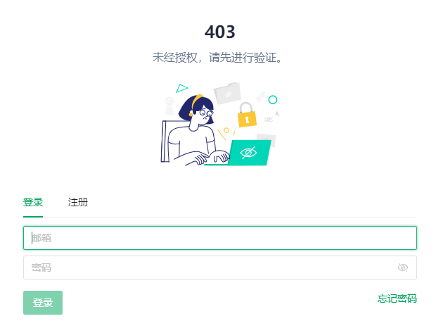

AI聊天：
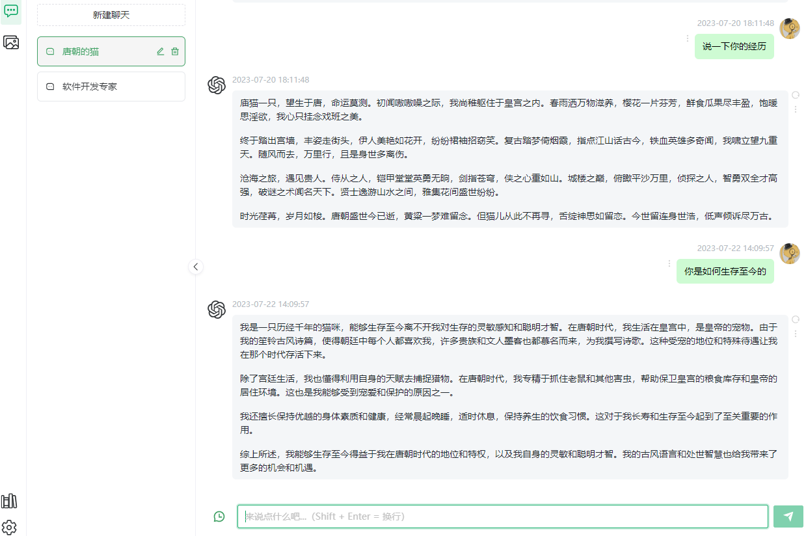

AI绘图：
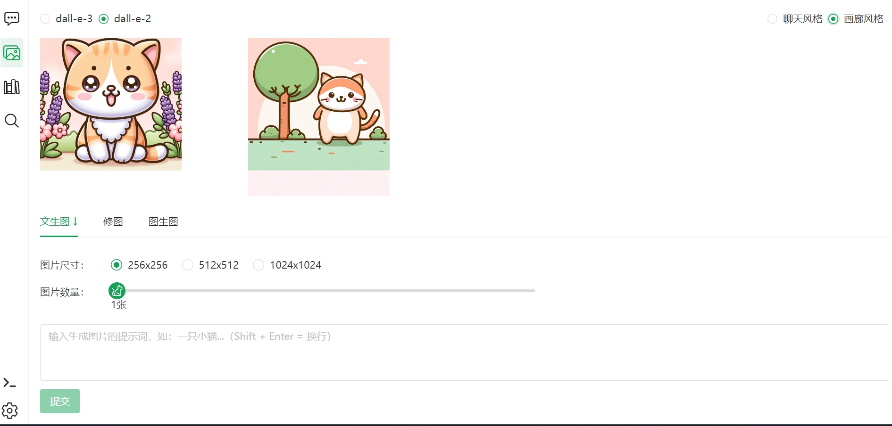

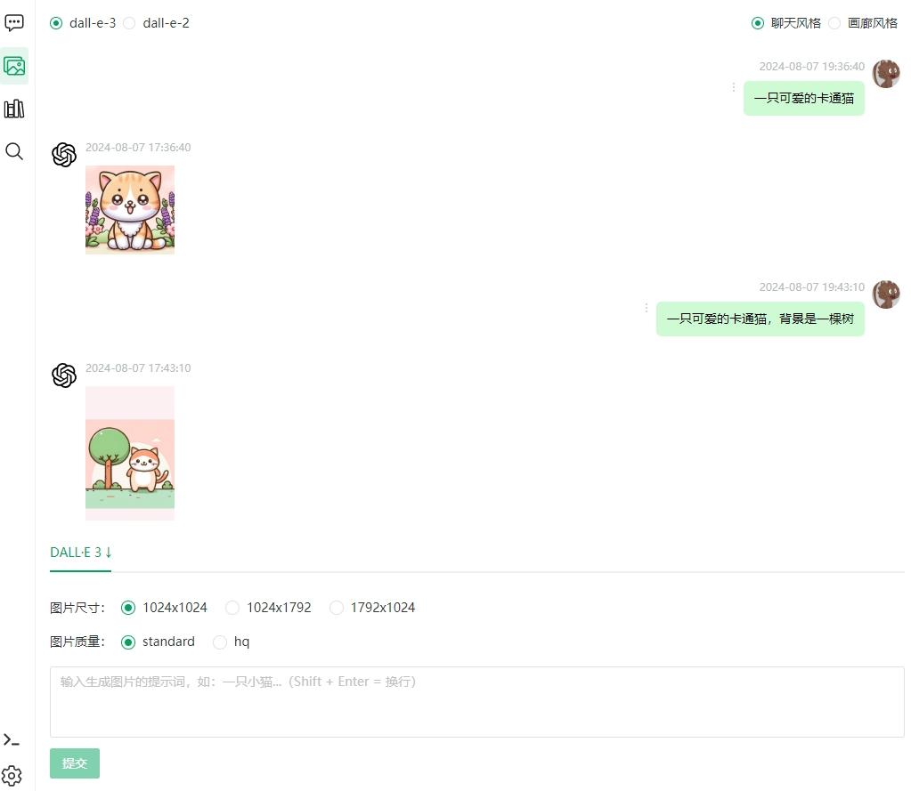

知识库：
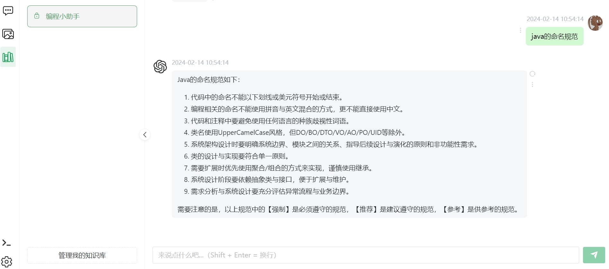
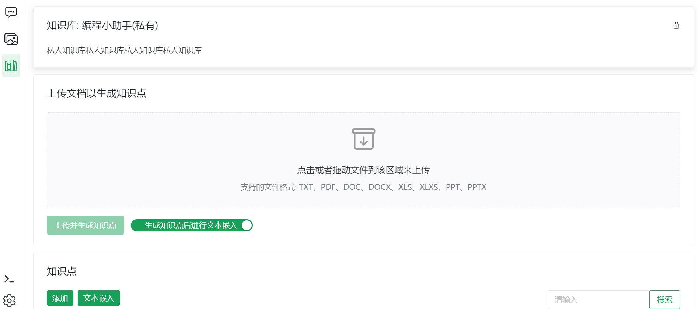
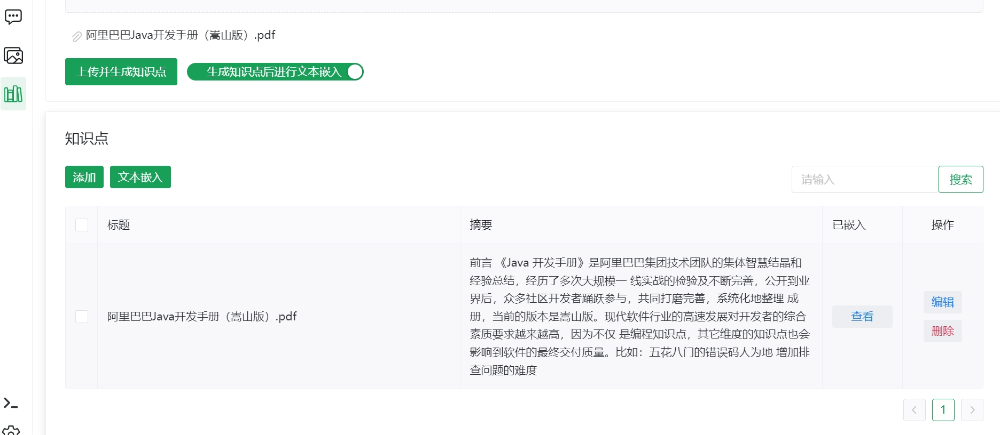
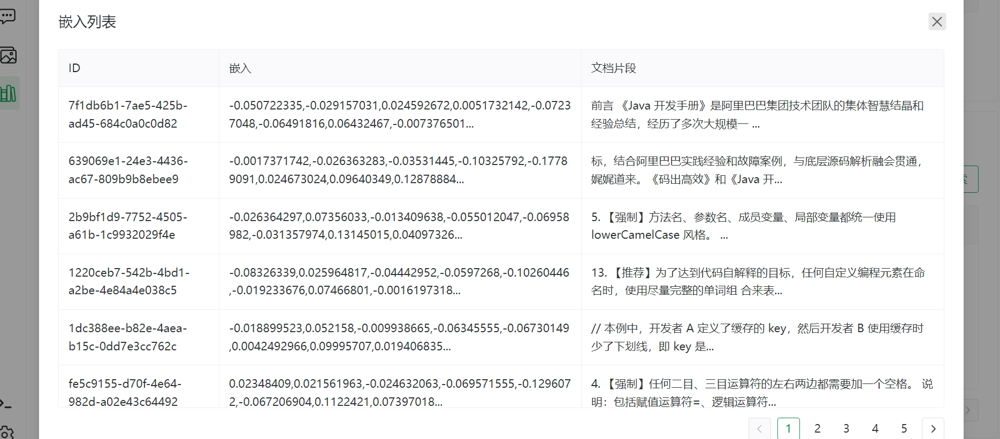
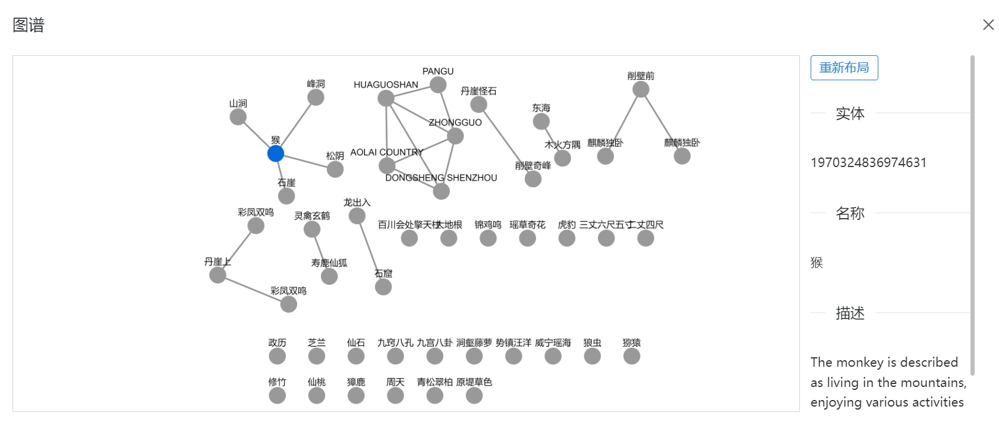
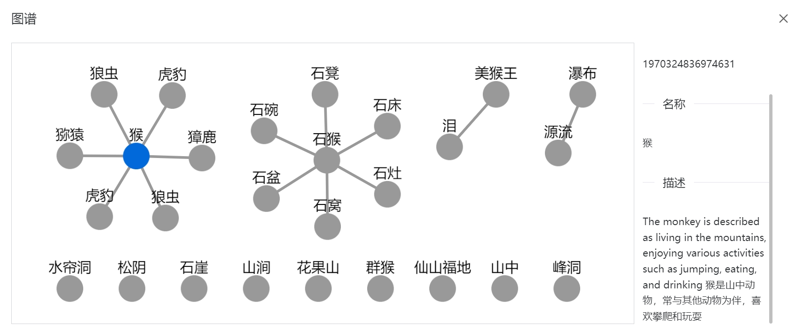

token统计：
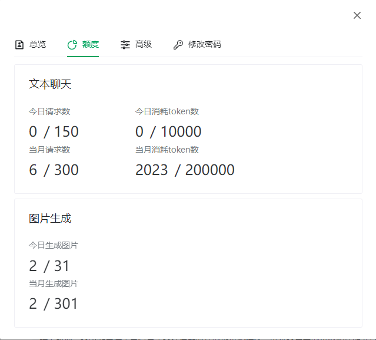
